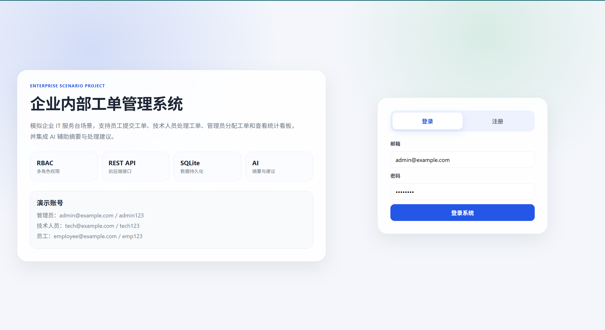
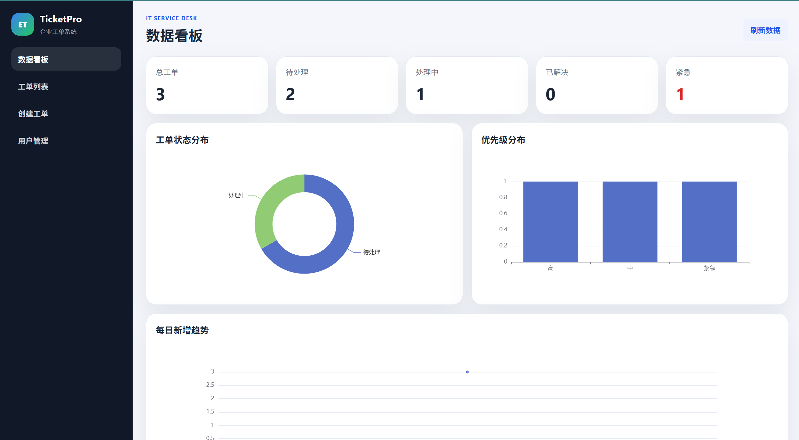
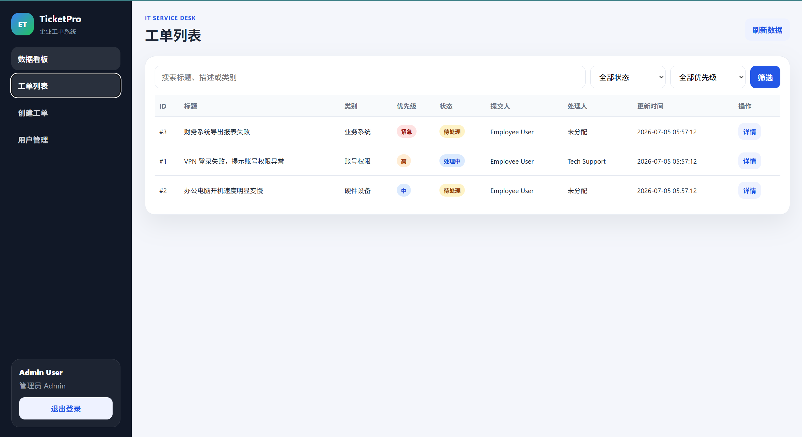
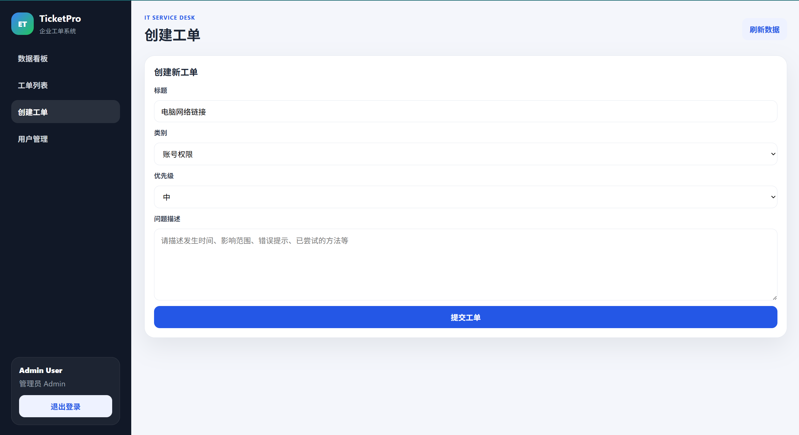
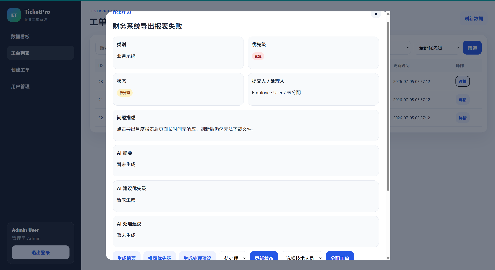
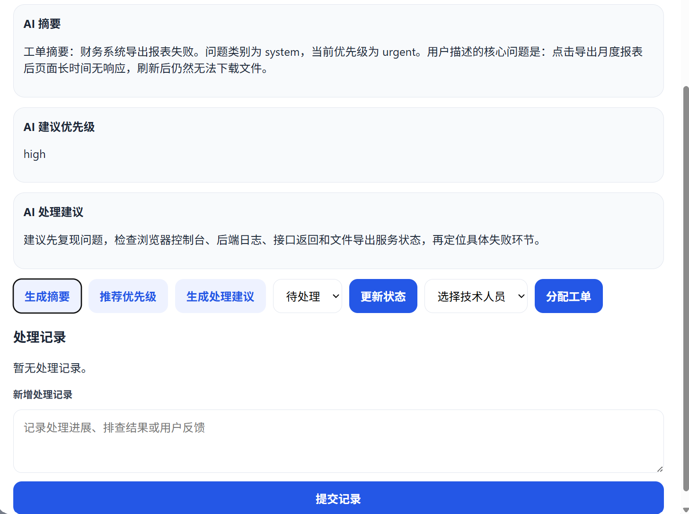
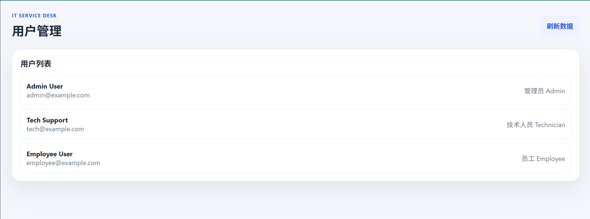
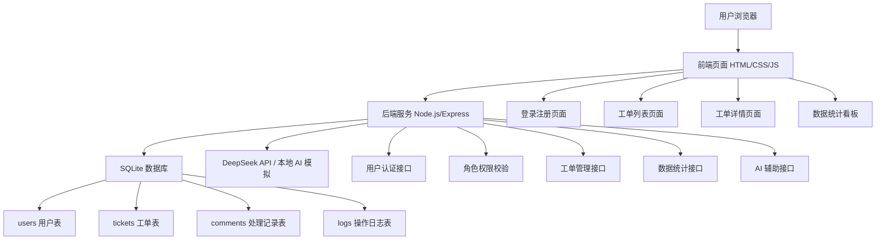

Enterprise Ticket Management System 企业内部工单管理系统

1. 项目简介
Enterprise Ticket Management System 是一个模拟企业内部 IT 服务台场景的全栈 Web 项目。系统支持员工提交工单、技术人员处理工单、管理员分配工单和查看统计看板，并集成 AI 辅助能力，用于生成工单摘要、推荐优先级和提供处理建议。

该项目定位为“企业业务场景模拟项目”，重点展示前后端接口开发、数据库设计、角色权限控制、业务流程流转、数据统计看板和 AI API 接入能力，适合作为软件工程、信息技术管理、数据分析与 AI 方向的申请作品集项目。

项目截图
登录页面


管理员数据看板

工单列表

创建工单

工单详情

AI 辅助建议

用户管理



2. 技术栈
前端：HTML、CSS、JavaScript
后端：Node.js、Express
数据库：SQLite
用户认证：JWT、bcryptjs
数据可视化：ECharts
AI 辅助：DeepSeek API，可选；未配置 Key 时使用本地模拟建议
项目管理：npm、Git/GitHub


3. 核心功能

用户与权限模块
用户注册与登录
JWT 身份认证
密码加密存储
三类角色权限：员工、技术人员、管理员
不同角色看到不同功能入口

工单管理模块
员工创建工单
查看工单列表
按状态、优先级和关键词筛选
查看工单详情
添加处理记录
更新工单状态
管理员分配技术人员

数据看板模块
总工单数量
待处理工单数量
处理中工单数量
已解决工单数量
紧急工单数量
状态分布图
优先级分布图
每日新增趋势图
技术人员处理量排行

AI 辅助模块
AI 生成工单摘要
AI 推荐工单优先级
AI 生成处理建议
支持 DeepSeek API
如果没有配置 API Key，系统会自动使用本地规则生成演示结果，方便项目展示和答辩


4. 技术架构图



5. 项目目录结构
```text
enterprise-ticket-management-system/
├── public/
│   ├── index.html          # 前端主页面
│   ├── styles.css          # 页面样式
│   └── app.js              # 前端交互逻辑
├── src/
│   ├── db.js               # SQLite 初始化与数据库操作
│   ├── middleware/
│   │   └── auth.js         # JWT 认证与角色权限中间件
│   ├── routes/
│   │   ├── auth.js         # 登录注册接口
│   │   ├── users.js        # 用户相关接口
│   │   ├── tickets.js      # 工单管理接口
│   │   ├── dashboard.js    # 数据看板接口
│   │   └── ai.js           # AI 辅助接口
│   └── utils/
│       └── ai.js           # DeepSeek API 与本地 AI 模拟逻辑
├── docs/
│   ├── api.md              # 接口说明
│   ├── architecture.md     # 架构说明
│   ├── database.md         # 数据库表设计
│   ├── project-summary.md  # 项目总结
│   └── resume.md           # 简历与申请材料写法
├── server.js               # 应用入口
├── package.json
├── .env.example
└── README.md
```


6. 运行方式

6.1 环境要求
先安装：
Node.js 18 或以上版本
npm
Chrome / Edge 浏览器


6.2 安装依赖
进入项目目录：
```bash
cd enterprise-ticket-management-system
npm install
```


6.3 配置环境变量
复制 `.env.example` 文件并改名为 `.env`：

```bash
cp .env.example .env
```
Windows 也可以直接手动复制一份 `.env.example`，重命名为 `.env`。

`.env` 示例：

```env
PORT=3000
JWT_SECRET=please_change_this_secret
DB_FILE=./data/tickets.db
DEEPSEEK_API_KEY=
DEEPSEEK_BASE_URL=https://api.deepseek.com/chat/completions
DEEPSEEK_MODEL=deepseek-chat
```

说明：

如果没有 DeepSeek API Key，可以先留空，系统仍然可以运行。
API Key 留空时，AI 功能会返回本地模拟结果，用于项目演示。
如果准备正式展示 AI 接口能力，可以填入自己的 DeepSeek API Key。

6.4 启动项目
```bash
npm start
```
启动成功后访问：
```text
http://localhost:3000
```


6.5 演示账号
| 角色 | 邮箱 | 密码 |
|---|---|---|
| 管理员 | admin@example.com | admin123 |
| 技术人员 | tech@example.com | tech123 |
| 员工 | employee@example.com | emp123 |


7. 使用流程
员工 Employee
1. 登录系统
2. 创建工单
3. 查看自己提交的工单
4. 查看处理状态
5. 添加补充说明
6. 问题解决后关闭工单

技术人员 Technician
1. 登录系统
2. 查看未分配或分配给自己的工单
3. 查看工单详情
4. 添加处理记录
5. 更新工单状态
6. 使用 AI 生成摘要、优先级建议和处理建议


管理员 Admin
1. 登录系统
2. 查看全部工单
3. 分配技术人员
4. 更新工单状态和优先级
5. 查看数据统计看板
6. 查看用户列表
7. 使用 AI 辅助工单处理


8. 项目亮点
1. 企业业务场景明确**：围绕企业 IT 服务台工单流转场景设计，比普通课程项目更接近真实企业开发。
2. 具备角色权限控制**：员工、技术人员、管理员拥有不同权限，体现后台系统常见 RBAC 思路。
3. 包含完整业务流程**：从工单创建、分配、处理、评论到关闭，形成完整业务闭环。
4. 有数据库设计能力体现**：设计 users、tickets、comments、logs 等表，支持数据持久化。
5. 包含数据统计看板**：通过 ECharts 展示状态分布、优先级分布和趋势数据。
6. AI 与业务结合**：AI 不是单纯聊天，而是用于摘要、优先级推荐和处理建议，更贴近企业应用场景。
7. 可本地运行展示**：即使没有真实 API Key，也可以完整演示核心功能。


9. 后续可扩展方向
文件上传与截图附件
邮件通知与站内提醒
更细粒度的权限管理
工单 SLA 超时提醒
Docker 部署
MySQL / PostgreSQL 替换 SQLite
前端框架重构，例如 Vue 或 React
增加单元测试与接口测试
加入日志搜索与审计功能
导出周报、月报 PDF


10. 项目总结
本项目完成了一个面向企业内部 IT 服务场景的工单管理系统，实现了用户认证、角色权限、工单流转、处理记录、数据统计和 AI 辅助建议等功能。通过该项目，我熟悉了企业后台系统的基本业务流程，理解了前后端接口、数据库表设计、权限控制和数据可视化之间的配合方式，也提升了将 AI 能力应用到实际业务场景中的能力。
与普通页面练习相比，本项目更加重视业务逻辑、工程结构和可展示性，适合作为软件工程、信息技术管理、数据分析与人工智能相关方向的申请作品集项目。
