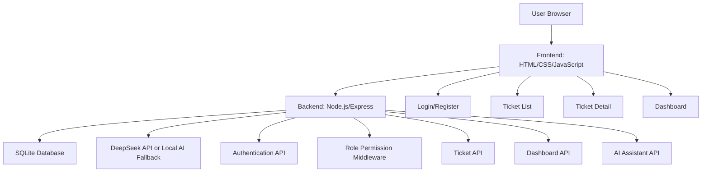

# GitHub / 作品集展示版 README 文案

下面内容适合复制到 GitHub README 或个人作品集网站中。

---

# Enterprise Ticket Management System

企业内部工单管理系统是一个模拟企业 IT 服务台场景的全栈 Web 项目。系统支持员工提交工单、技术人员处理工单、管理员分配工单和查看数据统计看板，并集成 AI 辅助能力，用于生成工单摘要、推荐优先级和提供处理建议。

本项目定位为企业业务场景模拟项目，重点展示 Web 全栈开发、数据库设计、角色权限控制、业务流程建模、数据统计看板和 AI API 应用能力。

## Features

- User registration and login
- JWT-based authentication
- Role-based access control: employee, technician, administrator
- Ticket creation, assignment, status update, and comment tracking
- Admin dashboard with ticket statistics and charts
- AI-assisted ticket summary, priority recommendation, and solution suggestion
- SQLite database for users, tickets, comments, and logs
- Local fallback AI logic when API key is not configured

## Tech Stack

- Frontend: HTML, CSS, JavaScript
- Backend: Node.js, Express
- Database: SQLite
- Authentication: JWT, bcryptjs
- Visualization: ECharts
- AI Integration: DeepSeek API

## Architecture



## Demo Accounts

| Role | Email | Password |
|---|---|---|
| Admin | admin@example.com | admin123 |
| Technician | tech@example.com | tech123 |
| Employee | employee@example.com | emp123 |

## Getting Started

```bash
npm install
npm start
```

Visit:

```text
http://localhost:3000
```

## Project Value

This project helped me understand how enterprise web systems are designed around business workflows. It covers not only basic CRUD operations, but also role-based permissions, ticket lifecycle management, dashboard visualization, database modeling, and AI-assisted business functions.
